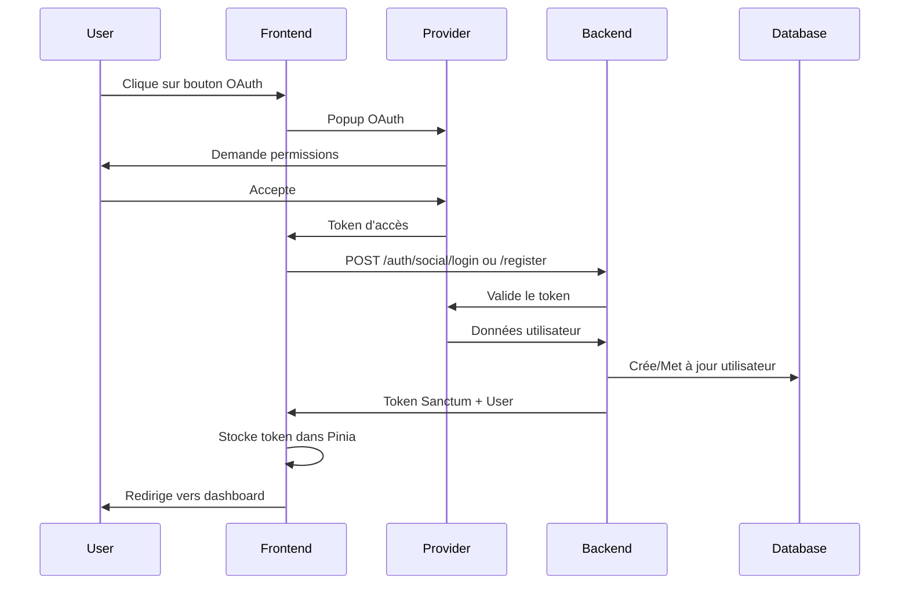
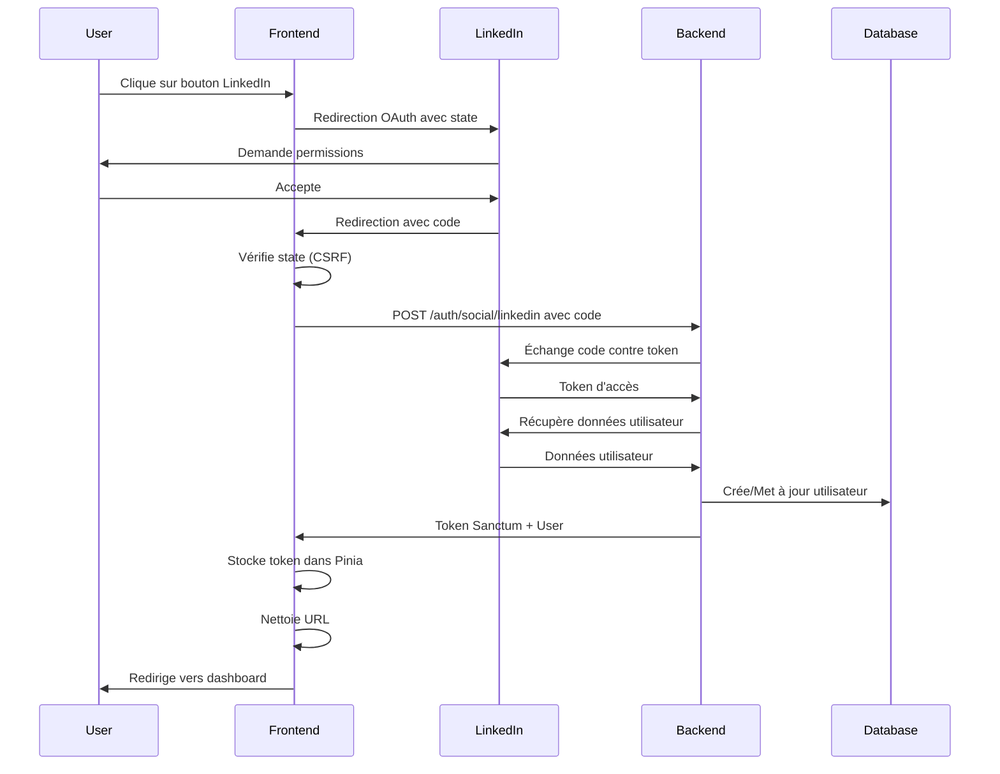

# Documentation de l'implémentation OAuth pour Qiryna

## Vue d'ensemble

Cette documentation décrit l'implémentation complète de l'authentification OAuth pour les réseaux sociaux dans l'application Qiryna. L'authentification est supportée pour **Google**, **Facebook** et **LinkedIn**.

## Architecture

### Endpoints API

L'API backend expose deux endpoints principaux :

1. **`POST /api/auth/social/login`** - Connexion OAuth
   - Pour utilisateurs ayant déjà un compte lié
   - Retourne une erreur si le provider n'est pas encore lié

2. **`POST /api/auth/social/register`** - Inscription/Liaison OAuth
   - Comportement intelligent :
     - Si l'email n'existe pas → Crée un nouveau compte
     - Si l'email existe → Lie le provider au compte existant (auto-linking)
     - Si le provider est déjà lié → Met à jour le token

3. **`POST /api/auth/social/linkedin`** (Endpoint spécial)
   - Gère le code OAuth de LinkedIn
   - Le backend échange le code contre un token

### Structure des requêtes

```typescript
// Pour Google et Facebook
{
  "provider": "google" | "facebook",
  "token": "access_token_from_oauth_provider"
}

// Pour LinkedIn
{
  "code": "authorization_code_from_linkedin"
}
```

### Réponse API

```typescript
{
  "success": true,
  "data": {
    "access_token": "sanctum_token",
    "user": {
      "id": "...",
      "email": "...",
      "name": "...",
      "role": "client",
      "profile": { ... },
      "settings": {
        "language": "fr"
      }
    }
  }
}
```

## Configuration

### Variables d'environnement requises

Créer un fichier `.env` avec les variables suivantes :

```bash
# Google OAuth
VITE_GOOGLE_CLIENT_ID=votre_google_client_id.apps.googleusercontent.com

# Facebook OAuth
VITE_FACEBOOK_CLIENT_ID=votre_facebook_app_id

# LinkedIn OAuth
VITE_LINKEDIN_CLIENT_ID=votre_linkedin_client_id

# API Backend
VITE_API_BASE_URL=https://api.qiryna.com
```

### Configuration Google

1. Aller sur [Google Cloud Console](https://console.cloud.google.com/)
2. Créer un projet ou sélectionner un projet existant
3. Activer l'API "Google+ API"
4. Créer des identifiants OAuth 2.0
5. Ajouter les origines JavaScript autorisées :
   - `http://localhost:5173` (développement)
   - `https://votre-domaine.com` (production)
6. Scopes requis : `openid`, `profile`, `email`

### Configuration Facebook

1. Aller sur [Facebook Developers](https://developers.facebook.com/)
2. Créer une application
3. Ajouter le produit "Facebook Login"
4. Configurer les URI de redirection OAuth :
   - `http://localhost:5173` (développement)
   - `https://votre-domaine.com` (production)
5. Permissions requises : `email`, `public_profile`

### Configuration LinkedIn

1. Aller sur [LinkedIn Developers](https://www.linkedin.com/developers/)
2. Créer une application
3. Ajouter les Redirect URLs :
   - `http://localhost:5173/fr/connexion` (développement)
   - `http://localhost:5173/en/login` (développement)
   - `https://votre-domaine.com/fr/connexion` (production)
   - `https://votre-domaine.com/en/login` (production)
4. Scopes requis : `openid`, `profile`, `email`

## Implémentation Frontend

### Store Auth (src/stores/auth/index.ts)

Le store Pinia expose plusieurs méthodes :

#### 1. `loginWithSocial(formData)`

Connexion OAuth pour utilisateurs existants.

```typescript
const { loginWithSocial } = useAuthStore();

const success = await loginWithSocial({
  provider: "google",
  token: "ya29.a0AfH6SMBx..."
});
```

#### 2. `registerWithSocial(formData)`

Inscription OAuth ou liaison de provider.

```typescript
const { registerWithSocial } = useAuthStore();

const success = await registerWithSocial({
  provider: "facebook",
  token: "EAABsbCS1iHgBO..."
});
```

#### 3. `authenticateWithSocial(formData, isRegister)` ⭐ Recommandé

Méthode unifiée qui essaie automatiquement login puis register si nécessaire.

```typescript
const { authenticateWithSocial } = useAuthStore();

// Pour le login (essaie login d'abord, puis register si User not found)
const success = await authenticateWithSocial({
  provider: "google",
  token: "ya29.a0AfH6SMBx..."
}, false);

// Pour l'inscription (utilise directement register)
const success = await authenticateWithSocial({
  provider: "google",
  token: "ya29.a0AfH6SMBx..."
}, true);
```

#### 4. `registerWithLinkedin(code)`

Méthode spéciale pour LinkedIn qui envoie le code OAuth au backend.

```typescript
const { registerWithLinkedin } = useAuthStore();

const success = await registerWithLinkedin("AQT8X7...");
```

### Composants OAuth

Les composants sont organisés en paires Login/Register pour chaque provider :

#### Google

- **Login** : `src/pages/Login/_Partials/GButton.vue`
- **Register** : `src/pages/Register/_Partials/GButton.vue`

**Fonctionnement** :
- Utilise la bibliothèque `vue3-google-login`
- Appelle `googleTokenLogin()` pour obtenir le token
- Envoie le token à l'API

**Exemple d'utilisation** :
```vue
<GButton />
```

#### Facebook

- **Login** : `src/pages/Login/_Partials/FButton.vue`
- **Register** : `src/pages/Register/_Partials/FButton.vue`

**Fonctionnement** :
- Utilise la bibliothèque `@healerlab/vue3-facebook-login`
- Popup Facebook pour authentification
- Extrait `response.authResponse.accessToken`
- Envoie le token à l'API

**Exemple d'utilisation** :
```vue
<FButton />
```

#### LinkedIn

- **Login** : `src/pages/Login/_Partials/LButton.vue`
- **Register** : `src/pages/Register/_Partials/LButton.vue`

**Fonctionnement** :
- Redirection OAuth manuelle vers LinkedIn
- Utilise les nouveaux scopes OpenID Connect (`openid profile email`)
- Protection CSRF avec state aléatoire
- Callback automatique pour récupérer le code
- Nettoyage de l'URL après authentification

**Exemple d'utilisation** :
```vue
<LButton />
```

## Fonctionnalités de sécurité

### 1. Protection CSRF (LinkedIn)

```typescript
// Génération d'un state aléatoire
const state = Math.random().toString(36).substring(7);
sessionStorage.setItem('linkedin_oauth_state', state);

// Vérification au retour
if (state !== storedState) {
  throw new Error("État OAuth invalide - Possible attaque CSRF");
}
```

### 2. Gestion des erreurs OAuth

Tous les composants incluent une gestion robuste des erreurs :

```typescript
try {
  // Authentification OAuth
} catch (error: any) {
  console.error("Erreur:", error);
  ElNotification({
    type: "error",
    message: error?.message || "Erreur lors de l'authentification"
  });
}
```

### 3. Validation des tokens

```typescript
if (!response || !response.access_token) {
  throw new Error("Token non valide");
}
```

### 4. Nettoyage des URLs

Après authentification LinkedIn, les paramètres OAuth sont supprimés de l'URL :

```typescript
window.history.replaceState({}, document.title, router.currentRoute.value.path);
```

## Flow d'authentification

### Google / Facebook



### LinkedIn



## Gestion des redirections

Après authentification réussie, l'utilisateur est redirigé :

1. **Si paiement en cours** : Vers le flux de paiement Stripe
2. **Si paramètre redirect** : Vers l'URL spécifiée dans `query.redirect`
3. **Login par défaut** : Vers la page d'accueil (`home`)
4. **Register par défaut** : Vers les paramètres utilisateur (`user-settings`)

```typescript
const handleRedirect = async () => {
  if (orderData.value !== null) {
    // Flux de paiement
    const resp = await iniPayment(orderData.value);
    if (resp) {
      window.location.href = redirectUrl.value;
    }
  } else {
    // Redirection normale
    router.currentRoute.value.query.redirect
      ? router.push(router.currentRoute.value.query.redirect as string)
      : router.push(i18nRoute({ name: "home" }));
  }
};
```

## Gestion des langues

L'application détecte automatiquement la langue de l'utilisateur depuis les settings retournés par l'API :

```typescript
await Tr.switchLanguage(data.user?.settings?.language ?? i18n.global.locale.value);
```

## Dépannage

### Erreur : "Token non valide"

**Causes** :
- Token OAuth expiré
- Token corrompu ou incomplet
- Permissions OAuth insuffisantes

**Solutions** :
- Redemander l'authentification
- Vérifier les scopes configurés
- Vérifier la validité du Client ID

### Erreur : "User not found" sur /login

**Cause** : L'utilisateur n'a jamais utilisé ce provider OAuth

**Solution** : Utiliser `/register` au lieu de `/login`, ou utiliser `authenticateWithSocial` qui gère automatiquement le fallback

### Erreur : "Ce compte est déjà lié à un autre utilisateur"

**Cause** : Le compte OAuth est déjà associé à un autre compte Qiryna

**Solutions** :
- Se connecter avec le compte original
- Utiliser un autre compte OAuth
- Contacter le support pour délier le compte

### LinkedIn ne redirige pas

**Causes** :
- URL de redirection non configurée dans l'app LinkedIn
- Client ID incorrect
- Scopes incorrects

**Solutions** :
- Vérifier les Redirect URLs dans l'app LinkedIn
- Vérifier `VITE_LINKEDIN_CLIENT_ID`
- Utiliser les scopes OpenID Connect : `openid profile email`

## Tests

### Test manuel

1. **Google** :
   ```bash
   # Ouvrir http://localhost:5173/fr/connexion
   # Cliquer sur le bouton Google
   # Accepter les permissions
   # Vérifier la redirection et le token stocké
   ```

2. **Facebook** :
   ```bash
   # Ouvrir http://localhost:5173/fr/connexion
   # Cliquer sur le bouton Facebook
   # Accepter les permissions
   # Vérifier la redirection et le token stocké
   ```

3. **LinkedIn** :
   ```bash
   # Ouvrir http://localhost:5173/fr/connexion
   # Cliquer sur le bouton LinkedIn
   # Vérifier la redirection vers LinkedIn
   # Accepter les permissions
   # Vérifier le retour et le nettoyage de l'URL
   # Vérifier le token stocké
   ```

### Vérifier le token stocké

```javascript
// Dans la console du navigateur
const authStore = JSON.parse(localStorage.getItem('authStore'));
console.log('Token:', authStore.token);
console.log('User:', authStore.user);
```

## Bonnes pratiques

### 1. Utiliser `authenticateWithSocial` pour le login

Cette méthode gère automatiquement le fallback login → register, offrant une meilleure expérience utilisateur.

### 2. Toujours gérer les erreurs

Utiliser des blocs try/catch et afficher des notifications utilisateur claires.

### 3. Nettoyer les données sensibles

- Ne jamais logger les tokens en production
- Nettoyer les paramètres OAuth de l'URL après traitement

### 4. Vérifier la configuration

Toujours vérifier que les variables d'environnement sont définies avant d'initier OAuth.

### 5. HTTPS en production

OAuth nécessite HTTPS en production pour la sécurité.

## Maintenance

### Mise à jour des scopes

Si les scopes OAuth changent, mettre à jour les composants :

- Google : Modifier `googleTokenLogin()` options
- Facebook : Modifier l'attribut `scope` de `<HFaceBookLogin>`
- LinkedIn : Modifier la variable `scope` dans `registerWithLinkedIn()`

### Mise à jour des bibliothèques

```bash
# Mettre à jour les dépendances OAuth
npm update vue3-google-login
npm update @healerlab/vue3-facebook-login
```

## Support

Pour toute question ou problème :

1. Consulter les logs navigateur (F12 → Console)
2. Consulter les logs backend (`storage/logs/laravel.log`)
3. Vérifier `API_OAUTH_ENDPOINTS.md` pour la documentation API
4. Consulter cette documentation pour l'implémentation frontend

---

**Version** : 1.0.0
**Dernière mise à jour** : 13 janvier 2026
**Auteur** : Équipe Qiryna
